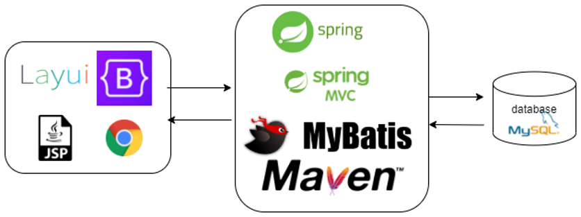
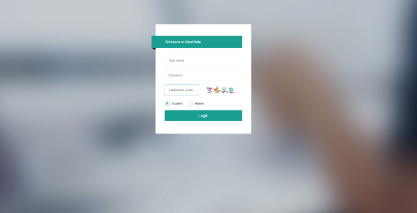
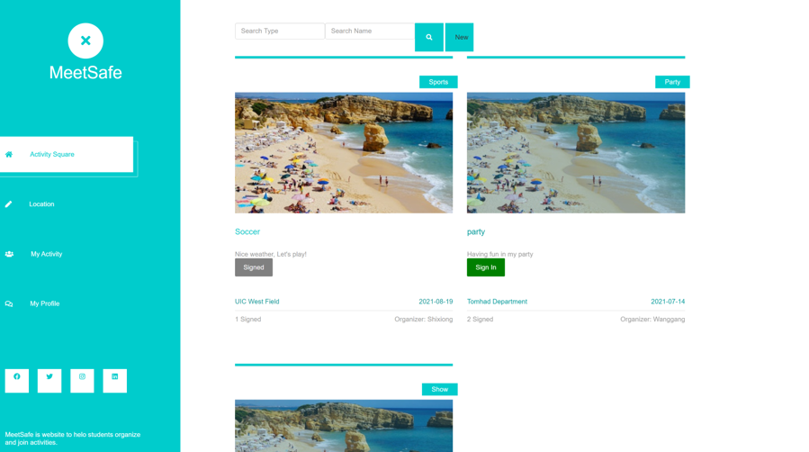
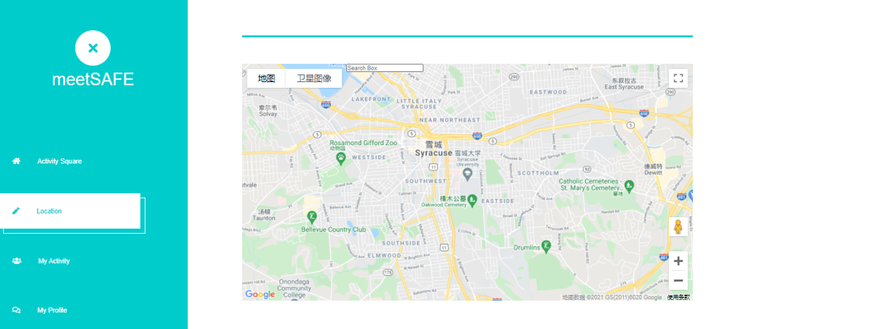

# meetSAFE

The project is a activity and health info management system. It involves two role of user. One for administrator and the other for normal student.

## Technologies Used
- JSP
- Bootstrap
- [Layui](https://github.com/layui/layui)
- SSM（Spring/SpringMVC/MyBatis)
- Maven
- MySQL
- Google map API

## Features

- Join/post/edit/delete activities
- Upload Covid19 health info
- Search for activity
- Management system

## Screenshots

## Setup

- Intellij IDEA 2020.1.1
- Java8
- Tomcat 9.0.38
- MySQL version: MySQL 8.0.20
  - Use the SQL file(meetSAFE.sql) to create the database

To run the project, first you need to deploy the tomcat as local server. We use tomcat 9.0.45 inside IDEA compiler as the server. And before running the system, you need to create the database. The SQL file is inside the project.

## Usage

When the normal student upload their health information and get approved from administrator, they can sign up/out for activities. Additionally, they can check the location by using Google map. After signing in, the administrator can pass or ban the status of normal students.

## Room for Improvement

Room for improvement:
- Improve location function
- Extend administrator management function
- Message board
- UI improvement

To do:
- Database Views for google location lookup
- Message board
- UI improvement
